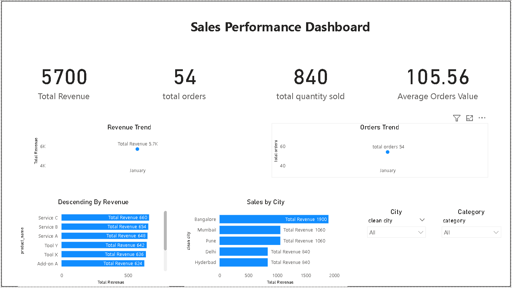

# 📊 E-commerce Sales & Customer Insights Analysis

This project focuses on analyzing E-commerce sales data to extract meaningful insights related to customer behavior, product performance, and revenue trends. The goal is to simulate a real-world business scenario where data is used to support decision-making.

---

## 🧠 Business Objective
To analyze sales data and answer key business questions such as:
- Which products generate the most revenue?
- What are the purchasing patterns of customers?
- Which cities contribute the highest sales?
- How does sales trend over time?

---

## 🛠️ Tools & Technologies
- *Excel* – Data cleaning and preprocessing  
- *SQL* – Data querying and analysis  
- *Python (Pandas)* – Data manipulation  
- *Power BI* – Dashboard creation and visualization  

---

## 📁 Dataset Overview
The dataset consists of three main tables:
- customers.csv – Customer details (demographics, signup info)
- products.csv – Product information (category, price)
- orders.csv – Transaction-level data (orders, quantity, revenue)

---

## 🔍 Key Analysis Performed
- Customer segmentation based on purchase behavior  
- Monthly and overall sales trend analysis  
- Identification of top-selling and high-revenue products  
- Revenue analysis by product category  
- City-wise customer distribution and contribution  

---

## 📈 Key Insights
- A small group of products contributes to a large portion of revenue  
- Certain cities show significantly higher customer activity  
- Repeat customers drive consistent revenue  
- Sales trends indicate potential seasonal patterns  

---

## 📊 Dashboard

---

## 💡 Conclusion
This project demonstrates the ability to transform raw data into actionable insights using a combination of SQL, Python, and visualization tools. It reflects a foundational understanding of data analysis workflow in a business context.
